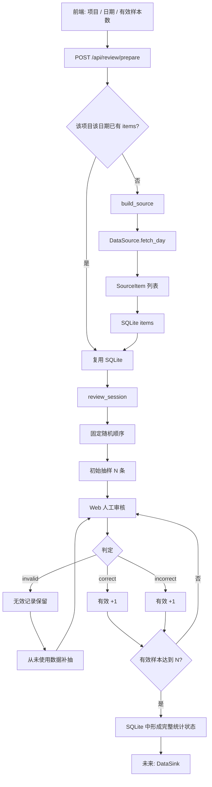

# 多项目数据抽样审核平台

> **AI / 新开发者请从这里开始。**
>
> 这个仓库不是“镔鑫专用爬虫”，而是一个可扩展的 **数据采集 + 固定抽样 + 人工审核 + 统计持久化框架**。
>
> 当前第一条已实现链路：
>
> **Windows → EasyConnect → 镔鑫钢铁铸坯号识别系统 → 当天数据索引 → 抽样 → 人工判定。**
>
> **轻推 / WPS 会话保持与自动上传当前暂停开发，不属于本版本验收目标。除非用户明确要求下一版本继续，否则不要修改或依赖轻推 Sink。**

---

## 0. 给 AI Coding Agent 的最短说明

以后用户可能只给你：

```text
README.md
+
某个新数据源网页保存下来的 HTML
```

你的目标应该是：

```text
读 README
↓
分析 HTML 中的登录 / 日期 / 表格 / 分页 / 图片结构
↓
新增 app/projects/<project>/source.py
↓
在 app/core/registry.py 注册 source type
↓
在 config/config.example.json 增加项目示例
↓
复用现有 Review Core 和前端
```

通常**不应该**为了新增数据源去修改：

```text
app/services/review_service.py
app/db.py
审核结果语义
invalid 补抽规则
前端快捷键
轻推 / WPS Sink
```

如果现有抽象确实不够，先解释为什么，再改核心。

---

# 1. 项目目标

实际会存在多个项目，每个项目可能拥有完全不同的数据线路：

```text
EasyConnect + Web
Atrust + Web
HTTP API
本地目录
共享文件夹
数据库
SFTP
远程 Agent
其他企业内网页面
```

但人工审核逻辑基本一致：

```text
选择项目
↓
选择日期
↓
设定当天有效样本数，例如 50
↓
从当天全集固定抽样
↓
显示原图 + 识别结果
↓
人工判：正确 / 错误 / 无效
↓
无效不计入分母，并自动补抽
↓
有效样本达到目标
↓
得到准确率统计
↓
结果持久化
↓
未来可通过 DataSink 上传到不同系统
```

因此项目分成三层：

```text
DataSource              Review Core              DataSink
数据怎么来              怎么抽样和审核            结果怎么出去

项目插件                通用核心                  项目插件 / 未来扩展
```

核心原则：

> **不同业务先转换成统一 `SourceItem`，之后全部走同一套审核逻辑。**

---

# 2. 总体架构



---

# 3. 当前版本边界

## 3.1 当前稳定能力

- 多项目统一配置；
- `DataSource` 抽象；
- SQLite 数据缓存和审核状态持久化；
- 同项目同日期固定、可复现抽样；
- `correct / incorrect / invalid`；
- `invalid` 自动补抽；
- 返回上一条并重新修改判定；
- 判定变化后的队列自动再平衡；
- 图片按需下载，不预下载当天所有图片；
- 图片 Magic Bytes 检查；
- Web 审核页面；
- 图片 90° 旋转；
- 快捷键；
- 镔鑫 EasyConnect + Web History 数据源；
- 镔鑫网站用户名密码自动登录；
- Windows 本机 Chrome。

## 3.2 当前暂停能力

### 轻推 / WPS 自动上传

当前存在二维码 / 手机验证 / OAuth / WPS 编辑器会话等不稳定问题。

本版本建议：

```json
"sink": {
  "enabled": false
}
```

审核完成后的统计已经存在 SQLite 中，可以通过 `/api/review/state` 得到：

```text
correct
incorrect
invalid
valid_count
accuracy
complete
```

CSV / JSON / 轻推自动上传可以在下一版本单独完善。

**Sink 失败不能影响 Source 拉取和 Review Core。**

---

# 4. 项目结构

```text
data-review-platform/
│
├── app/
│   ├── api.py                     # FastAPI 路由
│   ├── db.py                      # SQLite schema / upsert
│   │
│   ├── core/
│   │   ├── config.py              # config.json -> settings
│   │   ├── models.py              # SourceItem / Decision
│   │   └── registry.py            # source / sink 注册入口
│   │
│   ├── sources/
│   │   └── base.py                # DataSource 抽象接口
│   │
│   ├── sinks/
│   │   └── base.py                # DataSink 抽象接口
│   │
│   ├── services/
│   │   └── review_service.py      # 抽样 / 补抽 / 状态 / 统计核心
│   │
│   ├── projects/
│   │   └── binxin/
│   │       ├── source.py          # 镔鑫 Source
│   │       └── sink.py            # 实验性轻推 Sink，当前非主流程
│   │
│   └── static/
│       ├── index.html
│       ├── style.css
│       └── app.js                 # 前端审核 / 快捷键 / 图片旋转
│
├── config/
│   ├── config.example.json        # Git 中提交的模板
│   └── config.json                # 本机真实配置，不提交
│
├── runtime/                       # 全部运行数据，不提交
│   ├── review.sqlite3
│   ├── data/
│   ├── downloads/
│   ├── browser/
│   └── results/
│
├── requirements.txt
├── run.py
├── README.md
└── .gitignore
```

---

# 5. 核心契约：DataSource

基类：

```text
app/sources/base.py
```

```python
class DataSource(ABC):
    def __init__(self, project_config: dict):
        self.config = project_config

    @abstractmethod
    def check_available(self) -> bool:
        """当前数据线路是否可访问。"""
        ...

    @abstractmethod
    def fetch_day(self, business_date: date) -> list[SourceItem]:
        """返回某一天全部可审核记录的元数据。"""
        ...

    def materialize_image(self, image_url: str, destination: Path) -> Path:
        """真正需要展示该样本时，再把远程图片缓存到本地。"""
        ...
```

新项目最重要的是实现这个接口。

---

# 6. 核心数据模型：SourceItem

定义：

```text
app/core/models.py
```

```python
@dataclass(slots=True)
class SourceItem:
    source_key: str
    recognition_text: str
    image_path: Path | None = None
    image_url: str | None = None
    metadata: dict[str, Any] = field(default_factory=dict)
```

## 6.1 `source_key`

必须满足：

```text
稳定
唯一
可重复生成
```

同一项目、同一天、同一源记录，多次拉取必须得到相同 `source_key`。

推荐：

```text
源记录 ID
或
业务时间 + 图片名 + OCR + hash
```

不要：

```python
uuid.uuid4()
```

否则每次刷新都会产生“新记录”。

## 6.2 `recognition_text`

前端展示的模型识别结果，例如：

```text
Q195L107561
```

## 6.3 `image_path`

数据已经在本机时使用：

```python
SourceItem(
    ...,
    image_path=Path("D:/data/xxx.jpg"),
)
```

## 6.4 `image_url`

远端图片优先只保存 URL：

```python
SourceItem(
    ...,
    image_url="http://server/path/xxx.jpg",
)
```

实际显示时才下载。

## 6.5 `metadata`

保存项目特有字段，Review Core 不解释业务含义：

```python
metadata={
    "timestamp": "2026/08/23 15:35:47",
    "recognition_type": "正常",
    "true_value": "Q195L95L107561",
    "recognition_status": "已识别",
    "source_page": 2,
    "source_row": 31,
}
```

---

# 7. Source 与 Review Core 的职责边界

## Source 应负责

```text
VPN / 内网线路检查
网站登录
日期筛选
API 请求
HTML / DOM 解析
分页
业务字段映射
生成稳定 source_key
获取 image_url
必要时缓存远程图片
```

## Source 不应负责

```text
随机抽多少条
correct / incorrect / invalid 统计
invalid 补抽
准确率
上一条 / 下一条
SQLite review_queue
前端页面
```

这些全部属于：

```text
app/services/review_service.py
```

---

# 8. 为什么只索引元数据，图片延迟下载

例如一天：

```text
1430 条
```

只审核：

```text
50 条有效样本
```

不推荐：

```text
1430 条
↓
下载 1430 张图片
↓
再抽 50
```

当前模式：

```text
1430 条源记录
↓
fetch_day 只拿 metadata + image_url
↓
SQLite
↓
固定抽样 50
↓
前端真正打开某条
↓
GET /api/items/{item_id}/image
↓
source.materialize_image()
```

优点：

- 快；
- 节省网络；
- 节省磁盘；
- `invalid` 补抽时只多下载少量图片。

**以后网页型数据源默认也采用这个策略。**

---

# 9. 审核语义

## 9.1 `daily_target` 是有效样本数

配置：

```json
"daily_target": 50
```

真正结束条件：

```text
correct + incorrect = 50
```

不是：

```text
总共看过 50 张
```

## 9.2 三种结果

```text
correct      正确   → 有效样本
incorrect    错误   → 有效样本
invalid      无效   → 不进入有效分母，自动补抽
```

准确率：

```text
accuracy = correct / (correct + incorrect)
```

## 9.3 固定抽样

Review Core 使用：

```python
random.Random(f"{project_id}:{business_date}").shuffle(ids)
```

同项目、同日期、同一批数据：

```text
抽样顺序固定
```

因此 Source 不要自己再随机抽样。

## 9.4 invalid 自动补抽

目标 50：

```text
correct   40
incorrect  7
invalid    3
```

有效只有：

```text
47
```

系统自动从当天未进入审核队列的数据中补 3 条。

## 9.5 返回上一条修改结果

允许：

```text
invalid
↓
上一条
↓
改成 correct
```

核心会删除多余 replacement，保证最终有效样本数仍严格等于目标，而不是 51。

**补抽 / 回收逻辑只允许在 ReviewService 实现。**

---

# 10. SQLite 结构

默认数据库：

```text
runtime/review.sqlite3
```

## `items`

某项目某日的全集索引：

```text
id
project_id
business_date
source_key
image_path
image_url
recognition_text
metadata_json
created_at
```

唯一约束：

```text
(project_id, business_date, source_key)
```

## `review_sessions`

```text
project_id
business_date
target_size
created_at
updated_at
uploaded_at
upload_result_json
```

## `review_queue`

```text
session_id
item_id
seq
decision
reviewed_at
```

审核过程中浏览器关掉、FastAPI 重启，状态仍然保留。

---

# 11. `prepare` 为什么有时不会重新访问数据源

前端按钮：

```text
拉取并开始
```

调用：

```text
POST /api/review/prepare
```

Review Core 会先检查：

```text
该项目 + 日期是否已有 items
```

如果已有并且数量足够，默认直接复用，不重新访问内网。

配置：

```json
"refresh_on_prepare": false
```

调试新的 Source 时如果同一天已经被缓存：

- 临时改为 `true`；或
- 换一个日期；或
- 只清理明确需要重建的那一天数据。

**不要为了调试直接删除整个 `runtime/`。**

---

# 12. 当前前端

页面只负责人工审核，不包含项目采集逻辑。

显示：

```text
项目
日期
有效样本数
进度
正确
错误
无效
准确率
原始图片
识别结果
```

按钮 / 快捷键：

```text
1       正确
2       错误
3       无效并补抽
R       图片顺时针旋转 90°
←       上一条
→       下一条
```

图片旋转只改 CSS 展示：

```text
不修改源图片
不覆盖缓存文件
不改变数据库
```

---

# 13. 当前第一条链路：镔鑫

## 13.1 流程

```text
Windows
│
├── EasyConnect
│     ↓
│   企业内网
│
└── 本机 Chrome
      ↓
http://172.30.31.73:3000/#/history
      ↓
如有需要自动用户名密码登录
      ↓
设置当天 00:00:00 ~ 23:59:59
      ↓
History DOM
      ↓
遍历所有分页
      ↓
SourceItem[]
      ↓
SQLite
      ↓
固定抽样
      ↓
人工审核
```

## 13.2 EasyConnect

Source 先探测：

```text
http://172.30.31.73:3000/
```

如果已经通：

```text
直接继续
```

如果不通：

```text
寻找 / 启动 EasyConnect
↓
等待内网恢复
```

项目特有逻辑全部留在：

```text
app/projects/binxin/source.py
```

## 13.3 镔鑫网站登录

登录页稳定 selector 当前为：

```json
{
  "username": "input[placeholder=\"请输入用户名\"]",
  "password": "input[placeholder=\"请输入密码\"]",
  "login_button": "button:has-text(\"登录\")"
}
```

优先使用环境变量：

```powershell
$env:BINXIN_USERNAME="..."
$env:BINXIN_PASSWORD="..."
```

真实密码不要提交 Git。

## 13.4 日期

History 当前使用 Element Plus 日期范围：

```json
"start_date": "input.el-range-input[placeholder=\"开始时间\"]",
"end_date": "input.el-range-input[placeholder=\"结束时间\"]"
```

例如日期：

```text
2026-08-23
```

填：

```text
2026-08-23 00:00:00
2026-08-23 23:59:59
```

## 13.5 表格

当前审核数据来自 History 页面 DOM，而不是依赖导出文件。

表格字段：

```text
时间
识别类型
识别图片
字符识别铸坯号
真实铸坯号
人工复核铸坯号
未识别原因
识别状态
```

“数据导出”目前只可作为原始归档。

如果未来确认导出文件格式稳定、字段完整，可以只修改 `BinxinHistorySource`，改成解析导出文件；不要改 Review Core。

## 13.6 分页

当前自动读取所有页，而不是只取第一页。

必须保留：

```text
max_pages
```

防止 DOM 改版后分页死循环。

## 13.7 图片服务器特殊情况

镔鑫图片可能返回：

```text
HTTP 200
Content-Type: application/octet-stream
```

但实际上是标准 JPEG：

```text
FF D8 FF E0 ... JFIF
```

因此：

> **企业内网图片不能仅凭 Content-Type 判断。**

当前应使用 Magic Bytes：

```python
def detect_image_type(data: bytes) -> str | None:
    if data.startswith(b"\xff\xd8\xff"):
        return "jpg"
    if data.startswith(b"\x89PNG\r\n\x1a\n"):
        return "png"
    if data.startswith(b"GIF87a") or data.startswith(b"GIF89a"):
        return "gif"
    if data.startswith(b"BM"):
        return "bmp"
    if len(data) >= 12 and data[:4] == b"RIFF" and data[8:12] == b"WEBP":
        return "webp"
    return None
```

---

# 14. Windows / Chrome 约定

当前部署环境是 Windows，并已经有 Chrome。

Playwright 只负责控制浏览器：

```json
"browser": {
  "channel": "chrome",
  "headless": false,
  "user_data_dir": "./runtime/browser/binxin"
}
```

不要要求用户安装 Playwright Chromium：

```text
不要执行 playwright install chromium
```

项目独立 Profile：

```text
runtime/browser/binxin
runtime/browser/project_b
runtime/browser/project_c
```

不要直接复用用户日常 Chrome Profile，否则容易遇到锁冲突。

---

# 15. config.json 设计

真实配置：

```text
config/config.json
```

Git 模板：

```text
config/config.example.json
```

基础结构：

```json
{
  "server": {
    "host": "0.0.0.0",
    "port": 8100
  },
  "storage": {
    "db_path": "./runtime/review.sqlite3",
    "data_root": "./runtime/data"
  },
  "projects": [
    {
      "id": "example_project",
      "name": "示例项目",
      "enabled": true,
      "daily_target": 50,
      "source": {
        "type": "example_history",
        "refresh_on_prepare": false
      },
      "cache": {
        "type": "sqlite",
        "result_export_dir": "./runtime/results/example_project"
      },
      "sink": {
        "enabled": false
      }
    }
  ]
}
```

项目 URL、selector、浏览器路径、账号变量名等应进入配置或项目插件，不要写进 Review Core。

---

# 16. 新增数据源：标准流程

这是以后 AI 继续开发最重要的一节。

假设新增项目：

```text
ruifeng
```

## STEP 1：先分析用户提供的 HTML

不要先写代码。

先确认以下事实。

### 登录

```text
登录 URL
用户名 input selector
密码 input selector
登录 button selector
是否有验证码 / QR / MFA
登录成功后如何判断
```

优先 selector：

```text
placeholder
name
稳定 class
按钮文字
label
```

避免动态 ID：

```text
#el-id-1234-56
```

Element Plus 等框架可能每次刷新都变。

### 日期筛选

确认：

```text
日期组件类型
开始时间 selector
结束时间 selector
需要 Enter 还是点击查询
日期格式
筛选完成如何判断
```

### 表格

必须列清楚：

```text
row selector
图片列
识别结果列
时间列
其他 metadata 列
```

### 分页

确认：

```text
next selector
active page selector
last page / disabled 判断
```

### 图片

确认 HTML 能看到的是：

```text
absolute URL
relative URL
data:image
blob:
API 地址
```

如果 HTML 无法确认鉴权方式：

> 不要猜 Token。先做清晰日志，再让用户运行一次反馈真实错误。

---

## STEP 2：新增项目目录

```text
app/projects/ruifeng/
├── __init__.py
└── source.py
```

---

## STEP 3：实现 DataSource

推荐骨架：

```python
from __future__ import annotations

from datetime import date
from pathlib import Path

from app.core.models import SourceItem
from app.sources.base import DataSource


class RuifengHistorySource(DataSource):
    def __init__(self, project_config: dict):
        super().__init__(project_config)
        self.source = project_config["source"]

    def check_available(self) -> bool:
        return self._probe_route()

    def fetch_day(self, business_date: date) -> list[SourceItem]:
        records = self._fetch_records(business_date)

        result: list[SourceItem] = []
        for record in records:
            result.append(
                SourceItem(
                    source_key=self._source_key(record),
                    recognition_text=record["recognition"],
                    image_url=record.get("image_url"),
                    metadata={
                        "timestamp": record.get("timestamp", ""),
                    },
                )
            )
        return result

    def materialize_image(self, image_url: str, destination: Path) -> Path:
        # 真正审核到该记录时才调用
        ...
```

网页型 Source 推荐内部结构：

```text
_network / VPN
_login
_browser
_date_filter
_row_to_item
_scrape_current_page
_scrape_all_pages
fetch_day
materialize_image
```

不要把所有逻辑塞进一个超长 `fetch_day()`。

---

## STEP 4：注册 source type

入口：

```text
app/core/registry.py
```

例如：

```python
from app.projects.ruifeng.source import RuifengHistorySource


def build_source(project: dict):
    source_type = project["source"].get("type")

    if source_type == "binxin_history":
        return BinxinHistorySource(project)

    if source_type == "ruifeng_history":
        return RuifengHistorySource(project)

    raise ValueError(f"Unsupported source type: {source_type}")
```

项目数量还少时保持显式注册，便于 AI 和人工阅读。

---

## STEP 5：增加配置模板

```json
{
  "id": "ruifeng_ladle",
  "name": "瑞丰钢包号识别",
  "enabled": true,
  "daily_target": 50,
  "source": {
    "type": "ruifeng_history",
    "refresh_on_prepare": false,
    "history_url": "http://example/#/history",
    "browser": {
      "channel": "chrome",
      "headless": false,
      "user_data_dir": "./runtime/browser/ruifeng"
    },
    "auth": {
      "username": "",
      "password": "",
      "username_env": "RUIFENG_USERNAME",
      "password_env": "RUIFENG_PASSWORD"
    },
    "selectors": {}
  },
  "cache": {
    "type": "sqlite",
    "result_export_dir": "./runtime/results/ruifeng"
  },
  "sink": {
    "enabled": false
  }
}
```

真实账号只写：

```text
config/config.json
```

或环境变量。

---

## STEP 6：按顺序测试

不要一次同时改所有模块。

推荐：

```text
1. check_available
2. 登录
3. 日期筛选
4. 只解析第一页
5. 验证列映射
6. 全部分页
7. 检查 SourceItem 数量
8. 检查 source_key 是否重复
9. 单独测试一个 image_url
10. 测试 materialize_image
11. POST /api/review/prepare
12. 前端显示图片和 OCR
13. correct / incorrect / invalid
14. invalid 自动补抽
15. 返回上一条改判
```

Sink 不在这一轮测试里。

---

# 17. 新 HTML 到手时，AI 应先输出的分析模板

在开始改代码前，建议先给用户类似下面的结论：

```text
新项目：XXX

【登录】
URL:
username selector:
password selector:
login selector:
MFA:
成功判断:

【历史页】
URL:
日期组件:
开始 selector:
结束 selector:
查询方式:

【表格】
row selector:
时间列:
图片列:
OCR列:
metadata列:

【分页】
next selector:
active selector:
结束判断:

【图片】
URL 类型:
鉴权情况:

【计划修改】
1. app/projects/xxx/source.py
2. app/core/registry.py
3. config/config.example.json

【默认不修改】
review_service.py
db.py
前端审核语义
QingTui/WPS Sink
```

这样可以先确认页面事实，再写代码。

---

# 18. AI 开发硬规则

## Rule 1：README + HTML 是主要事实来源

不要凭旧对话猜新页面 DOM。

## Rule 2：新增项目优先新增插件

通常只动：

```text
app/projects/<project>/source.py
app/core/registry.py
config/config.example.json
```

## Rule 3：业务 selector 不进入核心

错误：

```text
review_service.py 里写 button:has-text("数据导出")
```

正确：

```text
projects/<project>/source.py
或 config.source.selectors
```

## Rule 4：Source 不抽样

`fetch_day()` 返回当天全集。

## Rule 5：图片默认 lazy download

只存 `image_url`，真正审核时再缓存。

## Rule 6：稳定 `source_key`

任何刷新都不能因为随机 UUID 产生重复数据。

## Rule 7：不要盲信 MIME

企业内网可能把 JPEG 返回为：

```text
application/octet-stream
```

应结合 Magic Bytes。

## Rule 8：Windows 默认用本机 Chrome

```python
channel="chrome"
```

不要默认下载 Playwright Chromium。

## Rule 9：Profile 按项目隔离

```text
runtime/browser/<project>
```

## Rule 10：凭据不硬编码

使用：

```text
config.json
或环境变量
```

## Rule 11：不要删除 runtime 历史数据

特别是：

```text
runtime/review.sqlite3
```

除非用户明确要求重置。

## Rule 12：错误必须可诊断

例如图片失败应尽量输出：

```text
URL
HTTP status
Content-Type
response size
response head / Magic Bytes
requests error
browser fallback error
```

不要只给一个无信息量的 `502`。

## Rule 13：Sink 与 Source 解耦

上传失败不能破坏：

```text
prepare
图片显示
人工审核
统计
```

## Rule 14：轻推 / WPS 当前冻结

除非用户明确开启下一版本，否则不要继续处理会话保存和自动上传。

---

# 19. API 入口

## 项目列表

```text
GET /api/projects
```

## 准备审核

```text
POST /api/review/prepare
```

```json
{
  "project_id": "binxin_billet",
  "business_date": "2026-08-23",
  "target_size": 50
}
```

## 查询状态

```text
GET /api/review/state?project_id=binxin_billet&business_date=2026-08-23
```

重要返回：

```text
target_size
correct
incorrect
invalid
valid_count
accuracy
complete
current
entries
```

## 提交审核

```text
POST /api/review/decision
```

```json
{
  "project_id": "binxin_billet",
  "business_date": "2026-08-23",
  "queue_id": 123,
  "decision": "correct"
}
```

允许：

```text
correct
incorrect
invalid
```

## 导航

```text
POST /api/review/navigate
```

## 图片

```text
GET /api/items/{item_id}/image
```

逻辑：

```text
已有 image_path
↓
直接 FileResponse

没有本地缓存
↓
找到 image_url
↓
build_source(project)
↓
source.materialize_image()
↓
缓存到 runtime/data/<project>/<date>/images/
```

---

# 20. Windows 启动

```powershell
cd data-review-platform

python -m venv .venv
.\.venv\Scripts\activate

python -m pip install -U pip
python -m pip install -r requirements.txt

Copy-Item config\config.example.json config\config.json

python run.py
```

如果真实 `config/config.json` 已存在，不要覆盖。

访问：

```text
http://127.0.0.1:8100
```

---

# 21. Git / 安全

应该提交：

```text
README.md
.gitignore
requirements.txt
run.py
app/
config/config.example.json
```

不要提交：

```text
config/config.json
runtime/
账号密码
浏览器 Profile
SQLite 数据库
下载图片
导出业务数据
日志
```

如果 `config/config.json` 以前已经被 Git 跟踪：

```bash
git rm --cached config/config.json
```

`.gitignore` 只能阻止未来未跟踪文件，不能自动取消已经跟踪的文件。

---

# 22. 未来开发方向

## P0：继续保持稳定

```text
DataSource 契约
固定抽样
invalid 补抽
SQLite 持久化
图片 lazy cache
```

## P1：新增数据源

目标是做到：

```text
README + 新页面 HTML
↓
AI 可以新增 Source
```

## P2：工程化

可考虑：

- Source 单元测试；
- HTML fixture 测试；
- Source debug CLI；
- 配置 JSON Schema；
- 自动插件注册；
- DOM 改版检测；
- 日志目录和结构化日志；
- 多用户 reviewer；
- CSV / XLSX 标准结果导出；
- 日报 / 周报。

## P3：DataSink

等多个 Source 稳定后再处理：

```text
轻推 / WPS
API
数据库
Excel
其他共享文档
```

上传是独立能力，不应反向影响采集和审核。

---

# 23. 最终架构原则

未来修改代码时始终保持：

> **DataSource：把不同来源变成统一 `SourceItem`。**
>
> **Review Core：只负责抽样、判定、补抽、统计和持久化。**
>
> **DataSink：只负责把最终结果送出去。**
>
> **新增项目优先增加插件和配置，不修改核心。**

如果下一次 AI 只有这份 README 和一个新的网页 HTML，它应当先从 HTML 识别登录、日期、表格、分页和图片结构，然后按照第 16～18 节新增 DataSource，并复用现有审核系统，而不是重新设计整个项目。
